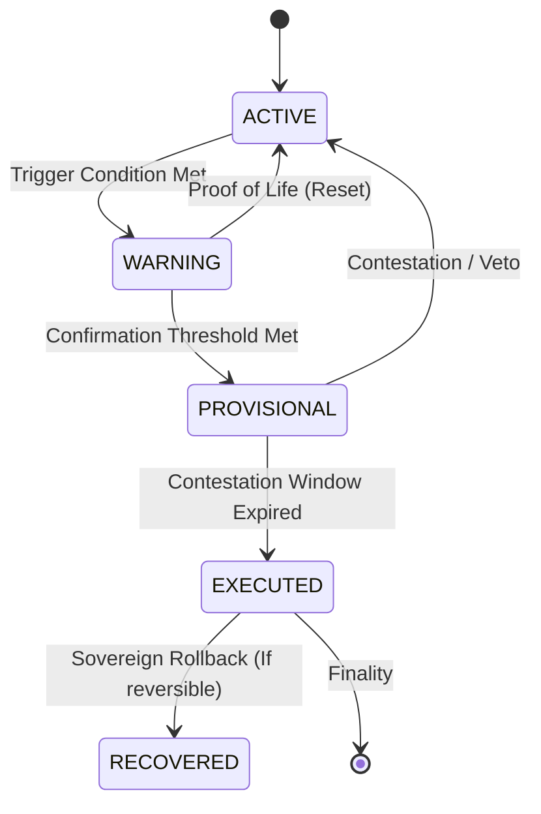

# IRON WALLET: Continuity Protocol Specification

> **Mandate**: Define the **Grammar of Continuity**—the machine-verifiable laws that govern absence, succession, and emergency authority.
> *Continuity is a safety system, not a notification flow.*

## 1. The Continuity State Machine (CSM)
Every Continuity Protocol must adhere to this verifiable lifecycle. It cannot jump from `ACTIVE` to `EXECUTED` without passing through safeguards.

### State Definitions
1.  **ACTIVE**: Nominal state. Protocol is monitoring (e.g., counting days of silence).
2.  **WARNING** (Soft Trigger): Threshold reached (e.g., 30 days silence). System attempts to contact Sovereign. No authority moves yet.
3.  **PROVISIONAL** (Hard Trigger): Confirmations received (e.g., 30 days + No Response + Nominee Vote). Authority transfer is *staged* but locked.
4.  **EXECUTED** (Finality): Contestation window (e.g., 72h) passed. Assets/Keys/Authority transferred.
5.  **RECOVERED**: Sovereign returns after Execution. Protocol attempts reverse interactions (if defined).

---

## 2. Trigger Grammar (L4 Primitives)
Protocols are composed of **Triggers** combined with boolean logic.

| Trigger Class | Type | Description | Kernel Dependency |
| :--- | :--- | :--- | :--- |
| **Chronos** | `TIME_ELAPSED` | True if $T_{now} - T_{last\_act} > \Delta$ | `DeterministicTime` (L0) |
| **Oracle** | `EXTERNAL_PROOF` | True if trusted 3rd party signs payload (e.g., Death Cert) | `IdentityManager` (L1) |
| **Quorum** | `MULTI_SIG_VOTE` | True if $N$ of $M$ Guardians sign "Yes" | `DelegationEngine` (L1) |
| **Lazarus** | `ACTIVITY_DETECTED` | True if Sovereign uses Private Key | `IdentityManager` (L1) |
| **Duress** | `PANIC_CODE` | True if specific "Duress PIN" entered | `Chaos` / `Client` |

---

## 3. Canonical Protocol Families

### 3.1 The "Sovereign Silence" (Deadman Switch)
*   **Intent**: "If I disappear, pass access to my partner."
*   **Logic**:
    1.  **IF** `TIME_ELAPSED > 30 Days` → **GOTO** `WARNING`
    2.  **IF** `WARNING` AND `NO_RESPONSE > 7 Days` → **GOTO** `PROVISIONAL`
    3.  **IF** `PROVISIONAL` AND `NOMINEE_SIGNS_ACCEPTANCE` → **START** `CONTESTATION_TIMER (72h)`
    4.  **IF** `CONTESTATION_TIMER` EXPIRES → **GOTO** `EXECUTED` (Transfer Key Shards)
*   **Safeguard**: Any `ACTIVITY_DETECTED` at any stage resets to `ACTIVE`.

### 3.2 The "Medical Emergency" (Incapacity)
*   **Intent**: "If I am in a coma, let my spouse see my Health Directive."
*   **Logic**:
    1.  **IF** `NOMINEE_REQUESTS_ACCESS` → **GOTO** `WARNING` (Alert Sovereign)
    2.  **IF** `WARNING` AND `TIME_ELAPSED > 4 Hours` (No Veto) → **GOTO** `PROVISIONAL`
    3.  **IF** `PROVISIONAL` AND `QUORUM (2 of 3 Guardians)` → **GOTO** `EXECUTED` (Reveal Directive)
*   **Safeguard**: Explicit "Immediate Veto" button on Sovereign's device blocks request.

### 3.3 The "Ultimate Succession" (Death)
*   **Intent**: "Upon my confirmed death, execute my Digital Will."
*   **Logic**:
    1.  **IF** `ORACLE_DEATH_CERT` (Government/Hospital Sig) → **GOTO** `PROVISIONAL`
    2.  **IF** `PROVISIONAL` AND `QUORUM (Lawyer + Spouse + Executor)` → **START** `CONTESTATION_TIMER (30 Days)`
    3.  **IF** `CONTESTATION_TIMER` EXPIRES → **GOTO** `EXECUTED`
*   **Safeguard**: High quorum requirement. Long contestation window.

---

## 4. Safety & Integrity Laws
1.  **No Silent execution**: Every state transition (Active -> Warning -> Provisional) must generate an **Immutable Event** in the `AuditLog`.
2.  **The "Lazarus" Override**: A valid signature from the Sovereign *always* trumps any protocol state. If the "Dead" user signs a transaction, the protocol immediately aborts.
3.  **Encrypted Staging**: Data/Keys aimed for transfer are encrypted *client-side* for the recipient. The Server never sees the payload, it only orchestrates the delivery.
4.  **Anti-Gaming**: Triggers must account for "Clock Skew" attacks. Use L0 Block Time, not Client OS Time.

---

## 5. Artifact generation
*   **Output**: These protocols compile to `IronProtocol` (L4) JSON DSL.
*   **Validation**: Must pass `SimulationEngine` (L3) "Stress Test" (e.g., "Simulate 100 years of silence") before deployment.
